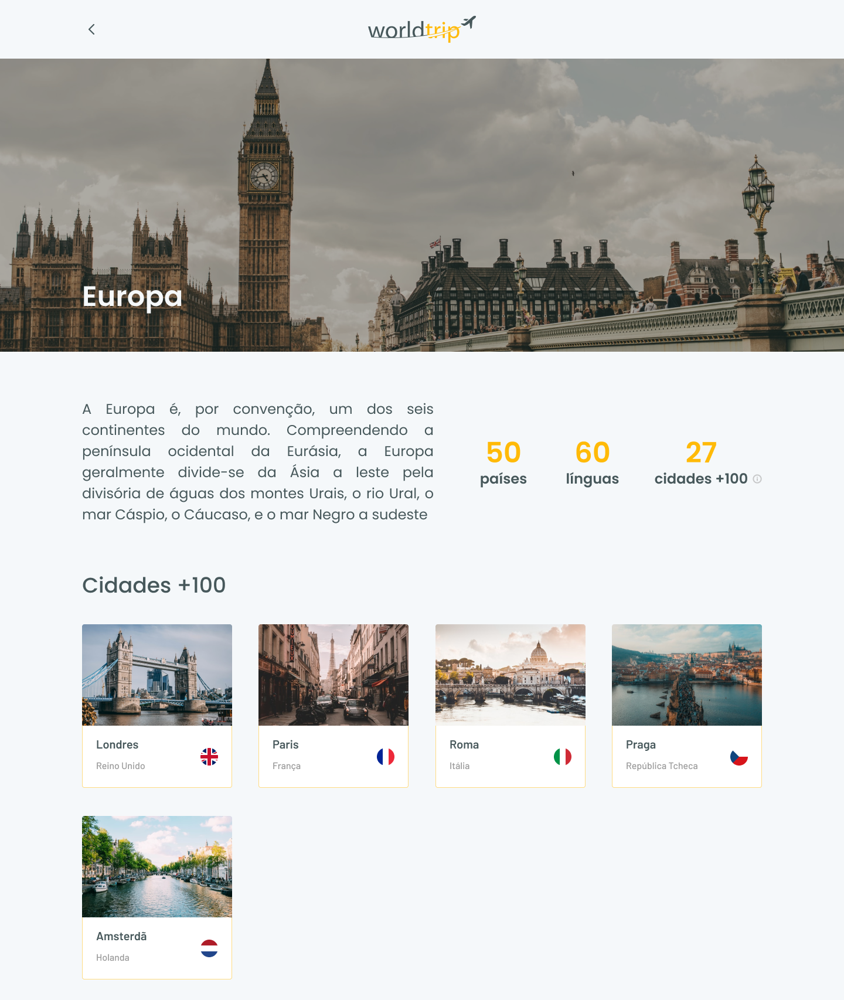

<p align="center">
  
</p>

<p align="center">
 <a href="#worldtrip">Sobre</a> •
 <a href="#%EF%B8%8Ffuncionalidades">Funcionalidades</a> •
 <a href="#-layout">Layout</a>  •
 <a href="#-como-executar-o-projeto">Como executar o projeto</a>  •
 <a href="#-tecnologias">Tecnologias</a>
</p>

# Worldtrip

Projeto para colocar em prática habilidades do NextJS e ChakraUI. <br />
Objetivo é criar um produto para fornece viagens, informando assim o usuário sobre seu destino.

<h4 align="center"> 🚧 Worldtrip 🚀 Em construção 🚧 </h4>
<!-- <h4 align="center"> 🚧 Worldtrip ✅ Concluído 🚧 </h4> -->

## ⚙️Funcionalidades

- [x] Criar as telas desktop para:
  - [x] Home
  - [x] Detalhe do continente
- [ ] Telas responsivas
- [ ] Fake api
- [ ] Navegação entre tela da home e o detalhe do continente no header

## 🎨 Layout

<p align="center" style="display: flex; align-items: flex-start; justify-content: center; gap: 8px ">
  
</p>

<p align="center" style="display: flex; align-items: flex-start; justify-content: center; gap: 8px ">
  
</p>

<a href="https://www.figma.com/file/LkxnIU9mg86SqrV6QBsRvw/Worldtrip?node-id=0%3A1">
  
</a>

## 🚀 Como executar o projeto

### Pré-requisitos

Antes de começar, você vai precisar ter instalado em sua máquina as seguintes ferramentas:

- [Git](https://git-scm.com) e [Node.js](https://nodejs.org/en/);
- Além disto é bom ter um editor para trabalhar com o código, como o [VSCode](https://code.visualstudio.com/).

Após tudo configurado e instalado

> Clone este repositório

```bash
 git clone https://github.com/vitormarco/worldtrip.git
```

> Acesse a pasta pelo terminal/cmd

```bash
 cd worldtrip
```

> Execute comando para instalar as dependências

```bash
 yarn
 # ou
 npm install
```

> execute o script para inicial o projeto

```bash
 yarn dev
 # ou
 npm run dev
```

## 🛠 Tecnologias

As seguintes ferramentas foram usadas na construção do projeto:

- ✔️ [ReactJS](https://reactjs.org/)
- ✔️ [Typescript](https://www.typescriptlang.org/)
- ✔️ [Next](https://nextjs.org/docs/basic-features/typescript)
- ✔️ [Chakra](https://chakra-ui.com/)

> Veja o arquivo [package.json](https://github.com/vitormarco/worldtrip/blob/master/package.json)

Feito com 🧡 por Vítor Marco 👋🏽 [Entre em contato!](https://www.linkedin.com/in/vitor-marco/)
